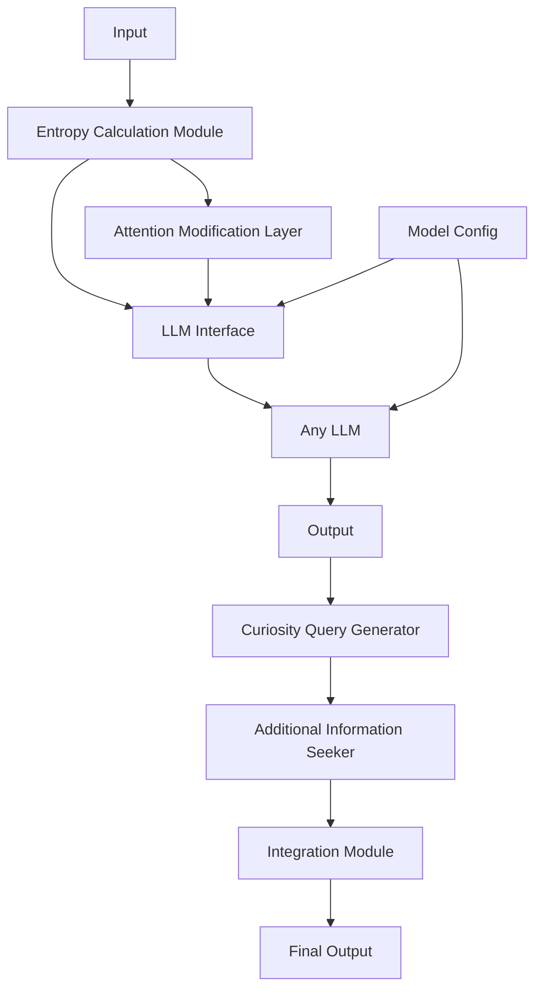
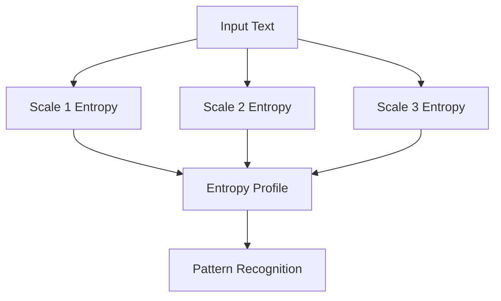

# CuriousLLM: Entropy-Based Curiosity for Language Models

## Overview

CuriousLLM is a flexible framework for incorporating entropy-based curiosity mechanisms into various Large Language Models (LLMs). This project enhances language models with the ability to focus on and explore high-entropy (potentially more informative or complex) regions of input text, regardless of the specific underlying LLM architecture. It also includes advanced techniques for distinguishing signal from noise in high-entropy regions.

## Schematic Graphs

### CuriousLLM Architecture

Below is a schematic representation of the CuriousLLM architecture:



### Multi-scale Entropy Analysis

CuriousLLM incorporates multi-scale entropy analysis to better distinguish signal from noise:



## Features

- Entropy calculation module for identifying high-information regions in text
- Abstract LLM interface for compatibility with various language models
- Modified attention mechanism that gives more weight to high-entropy regions
- Curiosity-driven query generation for proactive information seeking
- Flexible integration with existing LLM architectures
- Multi-scale entropy analysis for distinguishing signal from noise
- Advanced signal-noise distinction utilities

## Installation

1. Clone this repository:
   ```
   git clone https://github.com/yourusername/curious-llm.git
   cd curious-llm
   ```

2. Install the required dependencies:
   ```
   pip install torch transformers numpy scipy scikit-learn
   ```

## Usage

### Basic Usage

1. Import the necessary modules:
   ```python
   from curious_llm import CuriousLLM, calculate_entropy, identify_high_entropy_regions
   from transformers import AutoTokenizer, AutoModelForCausalLM
   ```

2. Load the model and tokenizer:
   ```python
   tokenizer = AutoTokenizer.from_pretrained('gpt2')  # or any other model
   base_model = AutoModelForCausalLM.from_pretrained('gpt2')  # or any other model
   model = CuriousLLM(base_model)
   ```

3. Process input text:
   ```python
   input_text = "Your input text here..."
   high_entropy_regions = identify_high_entropy_regions(input_text, tokenizer)
   ```

4. Generate output with curiosity-driven behavior:
   ```python
   input_ids = tokenizer.encode(input_text, return_tensors='pt')
   outputs = model(input_ids, high_entropy_regions=high_entropy_regions)
   ```

### Using Signal-Noise Distinction Utilities

To use the advanced signal-noise distinction utilities:

```python
from curious_llm.signal_noise_utils import signal_noise_distinction, multi_scale_entropy
from curious_llm.llm_interface import HuggingFaceLLMInterface
from transformers import AutoModel, AutoTokenizer

# Initialize your chosen model and tokenizer
model = AutoModel.from_pretrained("bert-base-uncased")  # or any other model
tokenizer = AutoTokenizer.from_pretrained("bert-base-uncased")  # or any other tokenizer

# Create an LLM interface
llm_interface = HuggingFaceLLMInterface(model, tokenizer)

# Analyze text for signal in high-entropy regions
text = "Your complex input text here with potential high-entropy regions."
signal_regions = signal_noise_distinction(text, llm_interface)
print(f"Potential signal regions: {signal_regions}")

# Perform multi-scale entropy analysis
entropy_profiles = multi_scale_entropy(text, llm_interface, scales=[1, 5, 10])
for i, profile in enumerate(entropy_profiles):
    print(f"Entropy profile at scale {i+1}: {profile}")
```

These utilities can work with any language model that implements the `LLMInterface`. This allows for flexibility in choosing the underlying model while maintaining the ability to perform advanced signal-noise distinction.

## Testing

To run the unit tests for CuriousLLM, use the following commands:

```bash
python -m unittest test_llm_interface.py
python -m unittest test_signal_noise_utils.py
python -m unittest test_curious_llm.py
```

Alternatively, you can run all tests at once using:

```bash
python -m unittest discover tests
```

Make sure you have all the required dependencies installed and that you're in the root directory of the project when running these commands.

## Project Structure

- `curious_llm/`
  - `__init__.py`
  - `model.py`: Contains the CuriousLLM model implementation
  - `entropy.py`: Implements entropy calculation and high-entropy region identification
  - `attention.py`: Contains the modified attention mechanism
  - `query_generator.py`: Implements the curiosity-driven query generator
  - `llm_interface.py`: Provides an abstract interface for different LLMs
  - `signal_noise_utils.py`: Utilities for distinguishing signal from noise in high-entropy regions

## Acknowledgments

- This project is designed to work with various LLM architectures.
- The concept of artificial curiosity is inspired by research in developmental robotics and cognitive science.
- The signal-noise distinction techniques draw from information theory and signal processing principles.
